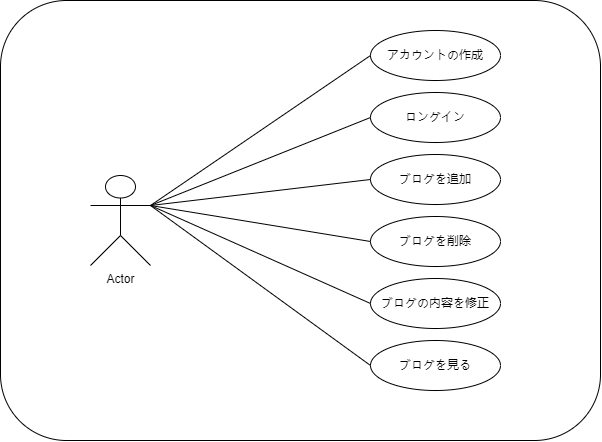
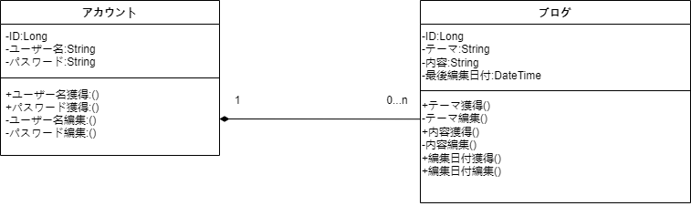
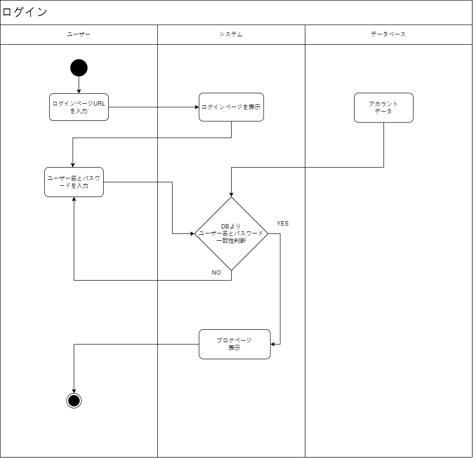
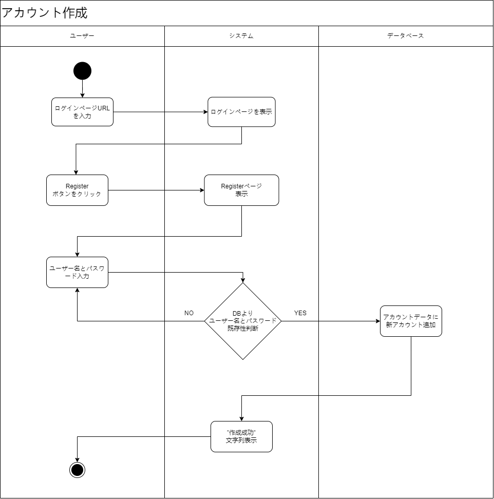
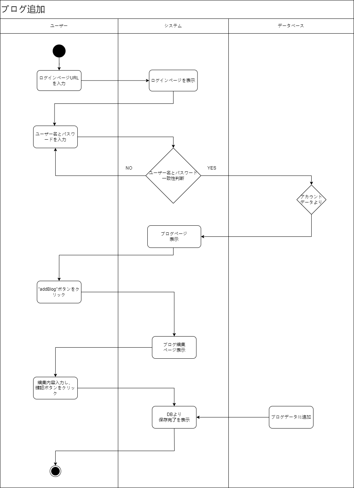
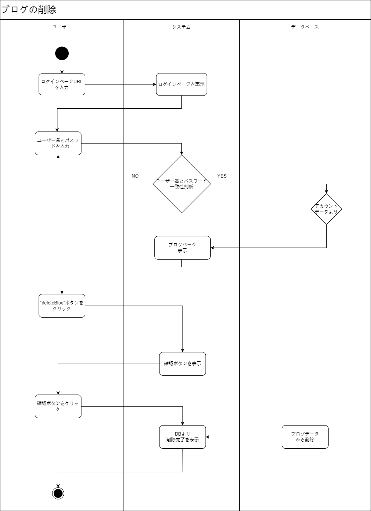
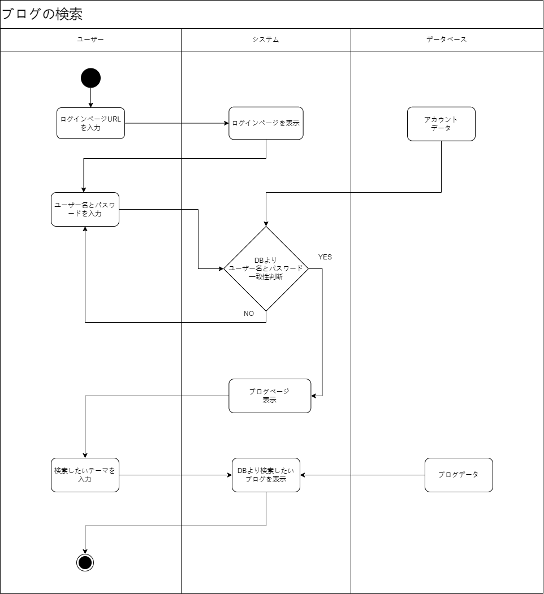

# BlogRepository
|日付|作業内容|
|--|--|
|0818|設計図作成|
|0819|設計図改修，loginPageとregisterPageの基本作成|
|0822|loginPageとregisterPageデザイン変更,編集と検索ページの基本作成|
|0823|フロント側の五つページの作成，デザインの設計|
|0824|Account部分MVC構築、データベースと接続|

## ユースケース図

## クラス図

## アクティビティ図

